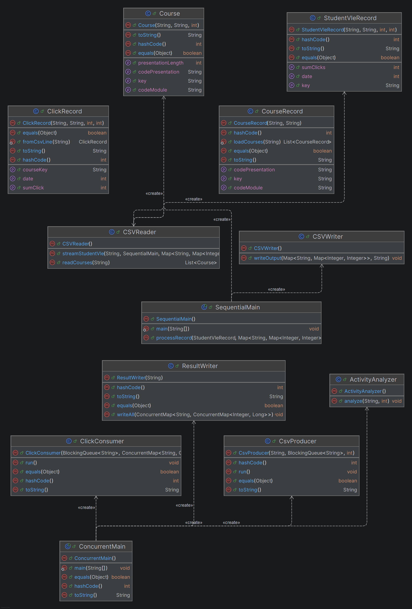

# OULAD Concurrent Data Analytics Engine

A multithreaded Java pipeline that aggregates 10.6 million rows of student-engagement data from the [Open University Learning Analytics Dataset](https://analyse.kmi.open.ac.uk/#open-dataset) into per-course daily click summaries, then identifies high-activity days against a user-defined threshold.

I built this to dig into the producer-consumer pattern at real scale — not toy datasets — and to find out whether throwing threads at a problem actually helps when the work-per-item is tiny.

## What it does

Given a 433MB CSV of ~10.6M student-click records, the pipeline:

1. Reads the file once
2. Aggregates clicks by `(course, date)` across all students and resources
3. Writes one summary CSV per course-presentation (e.g. `AAA_2013J.csv`)
4. Scans the summaries for days exceeding a click threshold and writes a single `activity-<threshold>.csv` report

There are two implementations: a single-threaded baseline (`SequentialMain`) and a producer-consumer concurrent version (`ConcurrentMain`) for benchmarking.

## Architecture



The concurrent pipeline uses one producer thread reading the file and N consumer threads doing the parse + aggregate work. They communicate via a bounded `LinkedBlockingQueue<List<String>>` — rows are batched in groups of 1,000 before being put on the queue (the reason is in the benchmark section below). Consumers terminate via a poison-pill sentinel (`Collections.emptyList()`).

Aggregation lives in a `ConcurrentHashMap<String, ConcurrentMap<Integer, Long>>`, with atomic `merge()` calls handling concurrent updates to the inner maps.

## Benchmark — and the lesson it taught me

Full dataset: 10,655,280 rows, 433 MB. Measured on commodity hardware over four runs per configuration; reported numbers are the mean of runs 2-4 (run 1 discarded as JVM warmup).

| Variant | Wall-clock (ms) | Throughput (rows/sec) |
|---|---|---|
| Sequential | 2,765 | ~3.85M |
| Concurrent, 2 consumers, batched (1000 rows/batch) | **2,213** | **~4.82M** |
| **Speedup** | | **1.25x** |

The interesting story is the version I _didn't_ ship. My first concurrent implementation put one row at a time on the queue — and benchmarked at **3,741 ms**, _slower_ than sequential. The per-row work (parse a CSV line, increment a counter) was smaller than the cost of `put()` / `take()` plus the contention on the inner maps. Once I batched rows into chunks of 1,000 before queueing, the queue overhead amortized across the batch and concurrent overtook sequential.

Full benchmark methodology, hardware, and run-by-run numbers are in [BENCHMARK.md](BENCHMARK.md).

## Project structure

    src/main/java/oulad/
    ├── analytics/                  Activity threshold filter
    ├── concurrentSolution/         Producer-consumer pipeline
    │   ├── CsvProducer.java        Reads file, batches rows, emits poison pills
    │   ├── ClickConsumer.java      Parses rows, aggregates into ConcurrentHashMap
    │   ├── ClickRecord.java        Row model
    │   ├── ResultWriter.java       Writes per-course summary CSVs
    │   └── ConcurrentMain.java     Entry point + timing instrumentation
    └── sequentialSolution/         Single-threaded baseline


## Running it

You'll need Java 11+ and the `studentVle.csv` file (~433MB) from the [OULAD dataset](https://analyse.kmi.open.ac.uk/open_dataset). Place it in `data/`. The other small files (`courses.csv` etc.) are included.

```bash
# Build
./gradlew build

# Run sequential
java -cp build/classes/java/main oulad.sequentialSolution.SequentialMain data/

# Run concurrent (threshold=10000, default 2 consumers)
java -cp build/classes/java/main oulad.concurrentSolution.ConcurrentMain data/ 10000

# Run concurrent with N consumers (optional 3rd arg)
java -cp build/classes/java/main oulad.concurrentSolution.ConcurrentMain data/ 10000 4

# Run full benchmark (4 runs of each, warmup-aware)
powershell -File scripts/run_benchmark.ps1   # Windows
bash scripts/run_benchmark.sh                # macOS / Linux
```

Outputs go to `data/` (per-course summaries) and `data/activity-<threshold>.csv` (high-activity days across courses).

## Testing

87 JUnit 5 tests covering both pipelines and the analytics layer.

```bash
./gradlew test
./gradlew jacocoTestReport   # opens at build/jacocoHtml/test/html/index.html
```

Measured coverage: **94% instruction, 88% branch, 91% line, 98% method.**

Static analysis runs via PMD on every build. Coverage gate is set to 70% via Jacoco.

## Known limitations and things I'd improve

I want to be upfront about the parts of this code I'd rewrite if I came back to it:

- **TOCTOU in `ClickConsumer`.** The inner-map initialization uses `putIfAbsent(...)` followed by `get(...)`, which is a check-then-act pattern. In this specific code the race is benign (the discarded inner map is empty, so no data is lost), but the correct idiom is `computeIfAbsent(...)`, which atomically checks and creates in a single call and avoids wasted allocations under contention.

- **Silent consumer death on malformed rows.** `Integer.parseInt` has no `try/catch` around it. If a row is malformed, the consumer thread dies uncaught — but its assigned poison pill is never consumed, so the remaining consumer eventually terminates "normally." The pipeline finishes without crashing, but work is silently lost. In a production system I'd wrap the parse, track a `malformedRowCount`, and assert at shutdown that `rowsProcessed + rowsSkipped == rowsRead`.

- **Hardcoded heuristics.** Batch size (1,000) and queue capacity (1,000) were picked from intuition and tested at the current scale. A real production version would benchmark these as a grid.

## Stack

Java 11, Gradle, JUnit 5, Jacoco, PMD. No external runtime dependencies — the concurrency primitives are all `java.util.concurrent`.
